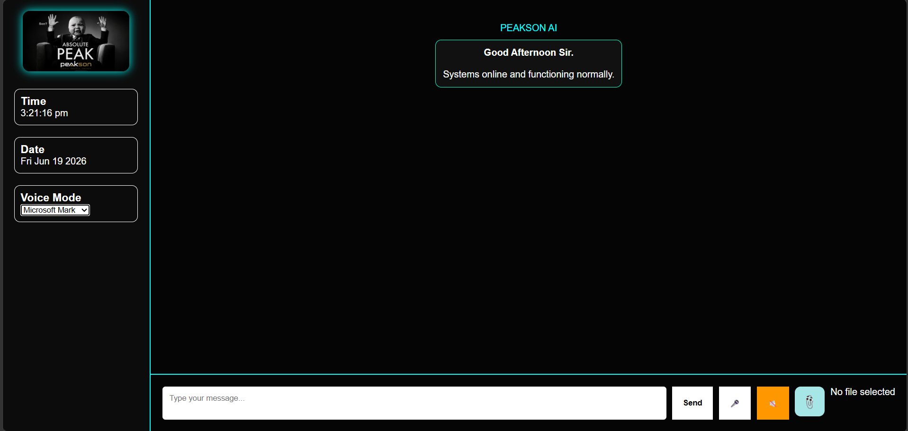

# PEAKSON AI

<p align="center">
  
</p>


PEAKSON AI is a Flask-based intelligent assistant inspired by JARVIS. It supports both text and voice interaction, analyzes uploaded images and PDF documents, generates AI-powered responses, and maintains conversation logs for future reference.

## User Interface

<p align="center">
  
</p>

## 🎥 Demo Video

[Watch PEAKSON AI Demo](https://drive.google.com/file/d/1QDjJrHgoxWZnOcDc5ocsPt1dqrqbmNAx/view?usp=sharing)


## Features

* Text Chat
* Voice Input (Speech Recognition)
* Voice Output (Text-to-Speech)
* Image Analysis
* PDF Question Answering
* File Upload Support
* Conversation Logging with Timestamps
* Dynamic Greetings
* Multiple Voice Modes
* Modern JARVIS-Inspired User Interface

## Technologies Used

* Python
* Flask
* HTML
* CSS
* JavaScript
* Google Gemini API
* PyPDF2
* Pillow (PIL)

## Project Highlights

* Real-time AI conversations
* Speech-to-Text functionality
* Text-to-Speech responses
* AI-powered image understanding
* AI-powered PDF analysis
* Conversation history logging
* Custom PEAKSON AI branding
* Responsive and user-friendly interface

## Developed By

Giridhar Harisree

## Run Locally

### Install Dependencies

```bash
pip install -r requirements.txt
```

### Start the Application

```bash
python app.py
```

### Open in Browser

```text
http://127.0.0.1:5000
```

## Future Enhancements

* User Authentication
* Chat History Dashboard
* Multi-file Analysis
* Cloud Deployment
* Advanced Voice Assistant Features
* Integration with Additional AI Models
